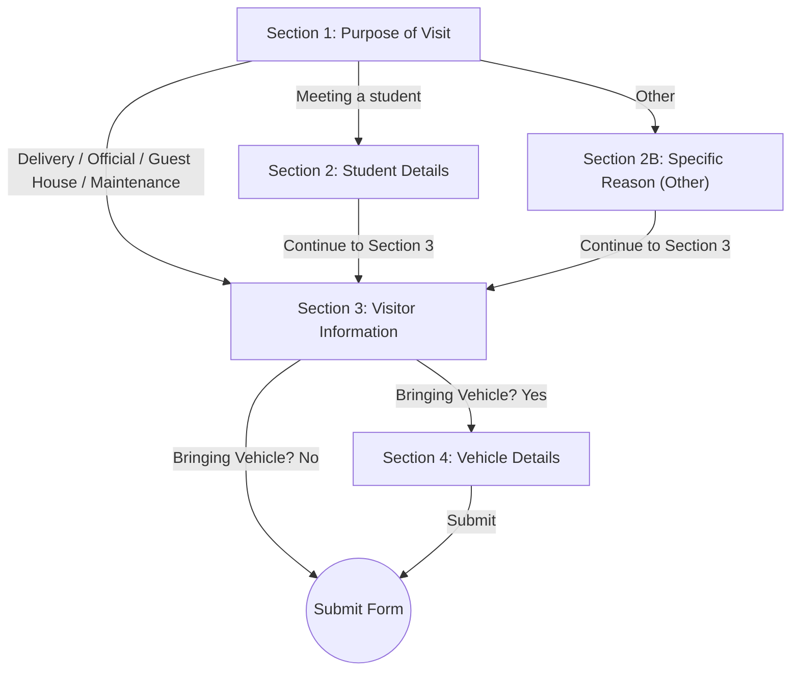

# Google Form & Apps Script Setup Guide for Visitor Entry/Exit

This guide documents the setup for the **HEIMDALL Campus Visitor Entry & Exit Self Check-In Form** using Google Forms and Google Apps Script.

---

## 1. Google Form Structure & Section Branching Logic

Create a new Google Form titled **"IIIT Pune Campus Visitor Entry Pass"**.

The form consists of **conditional sections** ensuring that:
1. When **"Meeting a student"** is selected ➔ Branches to **Student Host Details**.
2. When **"Other"** is selected ➔ Branches to **Specific Visit Reason (Required)**.
3. Universal visitor info & headcount are captured for everyone.
4. When **"Bringing Vehicle? Yes"** is selected ➔ Branches to **Vehicle Details**.



---

### **Section 1: Purpose of Visit**
* **Section Title:** `Campus Entry Purpose`
* **Description:** `Please specify your purpose of visiting IIIT Pune.`
* **Question 1 (Required):**
  * **Title:** `Purpose of Visit`
  * **Type:** `Multiple Choice`
  * **Settings:** Enable **"Go to section based on answer"** (click the 3 vertical dots ⋮ in the bottom right of the question card).
  * **Options & Branching:**
    1. `Meeting a student` ➔ **Go to Section 2 (Student Host Information)**
    2. `Delivery / Courier` ➔ **Go to Section 3 (Visitor Details)**
    3. `Official / Campus Visit` ➔ **Go to Section 3 (Visitor Details)**
    4. `Guest House / Visiting Faculty` ➔ **Go to Section 3 (Visitor Details)**
    5. `Maintenance / Vendor` ➔ **Go to Section 3 (Visitor Details)**
    6. `Other` ➔ **Go to Section 2B (Specific Visit Purpose)**

---

### **Section 2: Student Host Information** *(Shown only for "Meeting a student")*
* **Section Title:** `Student Information`
* **Description:** `Details of the student you are visiting on campus.`
* **Question 1 (Required):** `Student Full Name` (Short answer)
* **Question 2 (Required):** `Hostel Name` (Dropdown / Multiple Choice: `Hostel 1`, `Hostel 2`, `Hostel 3`, `Hostel 4`)
* **Question 3 (Required):** `Room Number` (Short answer, e.g., `B-204`)
* **Section Flow Configuration:**
  * At the very bottom of Section 2, configure:
  * **"After section 2"** ➔ Set to **"Go to section 3 (Visitor Details)"**.

---

### **Section 2B: Specific Visit Purpose** *(Shown only for "Other")*
* **Section Title:** `Specific Visit Purpose`
* **Description:** `Please provide the specific reason for your campus entry.`
* **Question 1 (Required):** `Specific Reason / Details`
  * **Type:** `Short answer`
  * **Required:** `Yes` (Toggle ON)
* **Section Flow Configuration:**
  * At the very bottom of Section 2B, configure:
  * **"After section 2B"** ➔ Set to **"Go to section 3 (Visitor Details)"**.

---

### **Section 3: Visitor Details** *(Common for All Visitors)*
* **Section Title:** `Visitor Details`
* **Description:** `Primary visitor contact details and party headcount.`
* **Question 1 (Required):** `Visitor Full Name` (Short answer)
* **Question 2 (Required):** `Visitor Mobile Number`
  * **Type:** `Short answer`
  * **Response validation:** `Regular expression` ➔ `Matches` ➔ `^[6-9]\d{9}$` (10-digit Indian mobile format)
* **Question 3 (Required):** `Number of Visitors (Total Headcount)`
  * **Type:** `Short answer`
  * **Response validation:** `Number` ➔ `Between` ➔ `1` and `20` (Whole number of people visiting together)
* **Question 4 (Required):** `Are you bringing a vehicle?`
  * **Type:** `Multiple Choice`
  * **Settings:** Enable **"Go to section based on answer"**
  * **Options & Branching:**
    * `Yes` ➔ **Go to Section 4 (Vehicle Details)**
    * `No` ➔ **Submit form**

---

### **Section 4: Vehicle Details** *(Shown only when Bringing Vehicle = Yes)*
* **Section Title:** `Vehicle Information`
* **Description:** `Vehicle registration details for parking and security verification.`
* **Question 1 (Required):** `Vehicle Registration Number`
  * **Type:** `Short answer`
  * **Description/Hint:** `e.g. MH12AB1234 (alphanumeric, 4–15 characters)`
* **Section Flow:**
  * **"After section 4"** ➔ **"Submit form"**

---

## 2. Google Apps Script Webhook Integration

1. In your Google Form, click **⋮ (top-right menu)** ➔ **Extensions** ➔ **Apps Script**.
2. Replace all existing code in `Code.gs` with the following production-ready script:

```javascript
/**
 * HEIMDALL Visitor Check-In Webhook Trigger
 * Sends visitor responses to the HEIMDALL backend server on form submission.
 */

// ── CONFIGURATION ─────────────────────────────────────────────────────────────
// Direct HTTPS tunnel (No Cloudflare anti-bot blocks):
const HEIMDALL_WEBHOOK_URL = 'https://f40c1d4e38950f.lhr.life/api/visitors/webhook';
const WEBHOOK_SECRET = ''; // Optional: matches VISITOR_WEBHOOK_SECRET in backend .env

/**
 * Triggered automatically on Google Form Submit.
 * DO NOT click 'Run' on this function manually in the Apps Script editor (e will be undefined).
 * To test from the editor, run 'testWebhookSubmission' instead.
 * 
 * @param {GoogleAppsScript.Events.FormsOnFormSubmit} e
 */
function onFormSubmit(e) {
  try {
    if (!e || !e.response) {
      Logger.log('⚠️ onFormSubmit was triggered without a Form event object (likely run manually). Use testWebhookSubmission() to test.');
      return;
    }

    const itemResponses = e.response.getItemResponses();
    const payload = {
      purpose: '',
      purposeDetails: '',
      studentName: '',
      studentHostel: '',
      studentRoomNo: '',
      name: '',
      phone: '',
      visitorCount: 1,
      hasVehicle: false,
      vehicleNumber: null,
      entryGate: 'Main Gate (Google Form)',
      submittedAt: new Date().toISOString(),
    };

    for (let i = 0; i < itemResponses.length; i++) {
      const itemResponse = itemResponses[i];
      const title = itemResponse.getItem().getTitle().trim().toLowerCase();
      const response = String(itemResponse.getResponse() || '').trim();

      if (title.includes('purpose of visit')) {
        payload.purpose = response;
      } else if (title.includes('specific reason') || title.includes('specify details') || title.includes('if other')) {
        payload.purposeDetails = response;
      } else if (title.includes('student full name') || title.includes('student name')) {
        payload.studentName = response;
      } else if (title.includes('hostel')) {
        payload.studentHostel = response;
      } else if (title.includes('room number') || title.includes('room no')) {
        payload.studentRoomNo = response;
      } else if (title.includes('visitor full name') || title.includes('visitor name')) {
        payload.name = response;
      } else if (title.includes('mobile number') || title.includes('phone')) {
        payload.phone = response;
      } else if (title.includes('number of visitors') || title.includes('headcount')) {
        const parsed = parseInt(response, 10);
        payload.visitorCount = !isNaN(parsed) && parsed >= 1 && parsed <= 20 ? parsed : 1;
      } else if (title.includes('bringing a vehicle') || title.includes('vehicle?')) {
        payload.hasVehicle = response.toLowerCase() === 'yes';
      } else if (title.includes('vehicle registration number') || title.includes('vehicle number')) {
        payload.vehicleNumber = response;
      }
    }

    // Safety fallback: if hasVehicle is false, ensure vehicleNumber is null
    if (!payload.hasVehicle) {
      payload.vehicleNumber = null;
    }

    // Send payload to HEIMDALL Backend Webhook
    sendPayloadToHeimdall(payload);
  } catch (error) {
    console.error('Error in onFormSubmit execution:', error.toString());
  }
}

/**
 * Helper to dispatch HTTP request to backend
 */
function sendPayloadToHeimdall(payload) {
  const options = {
    method: 'post',
    contentType: 'application/json',
    payload: JSON.stringify(payload),
    headers: {
      'x-webhook-secret': WEBHOOK_SECRET,
      'Bypass-Tunnel-Reminder': 'true', // Required for localtunnel
    },
    muteHttpExceptions: true,
  };

  Logger.log('Sending payload to HEIMDALL (' + HEIMDALL_WEBHOOK_URL + '): ' + JSON.stringify(payload));
  const response = UrlFetchApp.fetch(HEIMDALL_WEBHOOK_URL, options);
  const responseCode = response.getResponseCode();
  const responseText = response.getContentText();

  Logger.log('Server response [' + responseCode + ']: ' + responseText);

  if (responseCode >= 400) {
    console.error('Failed to post visitor to HEIMDALL:', responseText);
  } else {
    Logger.log('✅ Success: ' + responseText);
  }
}

/**
 * Run this function manually in Apps Script to test the webhook connection!
 */
function testWebhookSubmission() {
  Logger.log('🚀 Running test webhook dispatch...');
  const samplePayload = {
    name: 'Test Visitor from Apps Script',
    phone: '9876543210',
    purpose: 'Other',
    purposeDetails: 'Testing Google Apps Script Webhook',
    visitorCount: 1,
    hasVehicle: false,
    vehicleNumber: null,
    entryGate: 'Main Gate (Google Form)',
    submittedAt: new Date().toISOString(),
  };

  sendPayloadToHeimdall(samplePayload);
}

/**
 * Helper to install the onFormSubmit trigger programmatically.
 * (Run this only if your script was opened via Google Form -> 3 dots -> Script Editor)
 */
function installTrigger() {
  const form = FormApp.getActiveForm();
  if (!form) {
    Logger.log('❌ Could not find active form. Make sure you opened Script Editor from inside your Google Form.');
    return;
  }
  ScriptApp.newTrigger('onFormSubmit')
    .forForm(form)
    .onFormSubmit()
    .create();
  Logger.log('✅ Trigger successfully installed for form: ' + form.getTitle());
}
```

---

## 3. Install Trigger in Google Apps Script

### Method A: Using Triggers UI (Recommended & Most Reliable)
1. In the Apps Script left sidebar, click the **Triggers (⏰ Clock icon)**.
2. Click **+ Add Trigger** (bottom right).
3. Set the options:
   * **Choose which function to run**: `onFormSubmit`
   * **Choose which deployment should run**: `Head`
   * **Select event source**: `From form`
   * **Select event type**: `On form submit`
4. Click **Save** and accept any Google permissions prompt.

### Method B: Using `installTrigger` Function
1. In the toolbar function dropdown, select `installTrigger`.
2. Click **Run** (ensure you opened Script editor from within your Google Form).
3. Authorize the permissions prompt when asked.
4. You will see `✅ Trigger successfully installed` in the execution log.

---

## 4. Testing the Integration

1. Open the preview/live link of the Google Form.
2. **Scenario A (Other Purpose - Required Details):**
   * Select `Other` ➔ Form navigates to Section 2B.
   * Enter reason `Guest speaker for hackathon workshop` ➔ Form proceeds to Section 3.
   * Complete visitor details & submit.
   * Verify on HEIMDALL Dashboard: Purpose displays `Other` with note `📝 Guest speaker for hackathon workshop`.
3. **Scenario B (Meeting Student + Vehicle):**
   * Select `Meeting a student` ➔ Enter Student Name, Hostel, Room ➔ Section 3 ➔ Section 4 (`MH12AB1234`) ➔ Submit.
   * Verify headcount and vehicle on HEIMDALL Dashboard.
